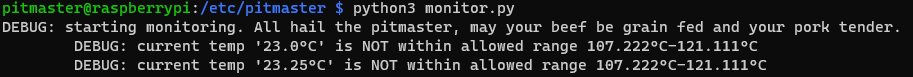
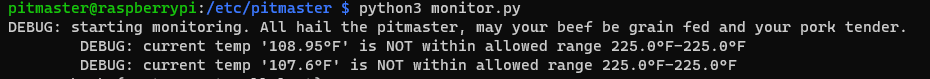
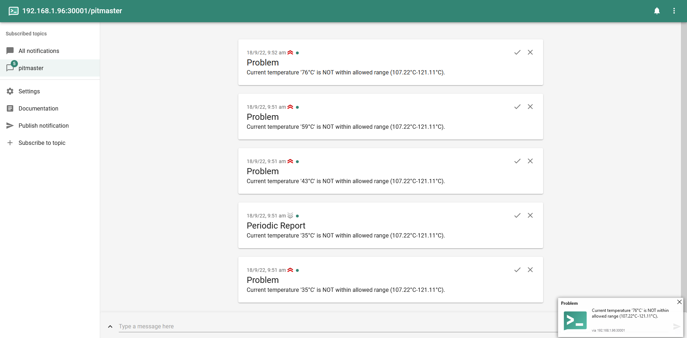
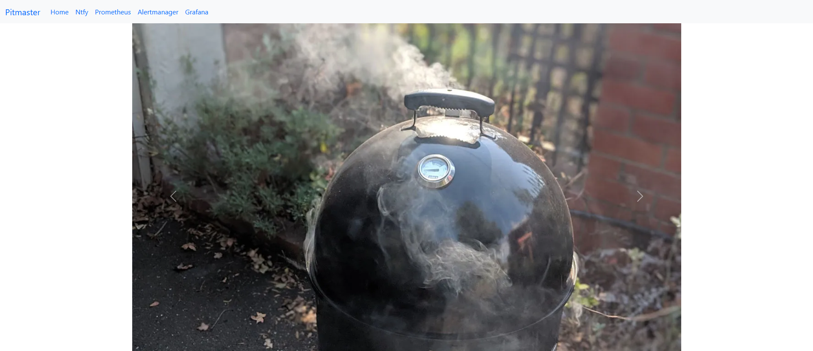

# Pitmaster

Build your own bbq monitoring solution. Eventually, I'll update with a fan to completely automate the cook. Maybe.

## What is it

A temperature probe in a smoker connected to a device that frequently reads the temperature and analyzes it.

For normals



For fahrenheiters



- if its outside the configured temperature range, flash a red LED and send a push notification
- if its within the configured temperature range, flash a green LED

[Ntfy](https://ntfy.sh/) is used for push notifications which has a phone app and website so you can receive real time updates anywhere:



Also included is a website that really only serves to provide convenient links



To a grafana dasboard


It's quite simple to do with a bit of persistence so don't think its overwhelming. You don't need to know any code to build your own!

## Hardware parts

You can substitute anything in this guide as you please, I've explicitly listed everything I used to be a reference point for my forgetful self in the future. If you do substitute big changes like an arduino instead of a rpi3, then you probably need to look up the GPIO pins for that model.

| Item                                                                                                                 | Purpose                                           |
| -------------------------------------------------------------------------------------------------------------------- | ------------------------------------------------- |
| [rpi 3 model B+](https://core-electronics.com.au/raspberry-pi-3-model-b-plus.html)                                   | mini computer to read temperatures and notify you |
| [heatsink](https://core-electronics.com.au/al-heat-sink-with-adhesive-tape-28x28x9mm.html)                           | optional - reduce board temperature               |
| [soldering iron](https://core-electronics.com.au/hakko-red-soldering-iron-20w.html)                                  | melt solder                                       |
| [solder](https://core-electronics.com.au/solder-leaded-15-gram-tube.html)                                            | create circuits                                   |
| [MAX31855](https://core-electronics.com.au/thermocouple-amplifier-max31855-breakout-board-max6675-upgrade-v2-0.html) | Read thermocouple                                 |
| [K-type thermocouple](https://core-electronics.com.au/thermocouple-type-k-glass-braid-insulated.html)                | read temperatures                                 |
| [Female to male jumper cables](https://core-electronics.com.au/jumper-wires-7-8-f-m-high-quality-30-pack.html)       | connect pi GPIO to breadboard                     |
| [breadboard](https://core-electronics.com.au/solderless-breadboard-830-tie-point-zy-102.html)                        | create circuits                                   |
| [LEDs](https://core-electronics.com.au/5mm-leds-100-pcs-pack-20x-red-green-blue-yellow-white.html)                   | optional - visually indicate current temp         |
| [jumper wire kit](https://core-electronics.com.au/jumper-wire-kit.html)                                              | connect circuits on breadboard                    |
| [resistors](https://core-electronics.com.au/resistor-kit-1-4w-500-total.html)                                        | create circuits                                   |

## Guide

The MAX31855 ships like this


Solder the pieces together to look like this (long legs downwards to fit into breadboard).


Put the MAX31855 anywhere into the breadboard, note that the actual location doesn't matter (within electrical circuit reason). If you want specifics, just follow this image.


For beginners, note that the MAX31855 is inserted on the left half (ABCDE) and positioned not in column A as thats where the jumper cables connect.

Make sure you place the jumper cables in the exact same places (color doesn't matter)

Connect the GPIO to breadboard circuit like so

| GPIO   | GPIO position # | MAX31855 |
| ------ | --------------- | -------- |
| 3.3V   | #1              | Vin      |
| GND    | #6              | GND      |
| MISO   | #21             | DO       |
| GPIO 5 | #29             | CS       |
| SCLK   | #23             | CLK      |

Optionally, add your heatsink


Enable SPI on the pi (raspi-config //TODO: ansible task) and reboot

Create your user on the pi

```sh
sudo adduser pitmaster
```

## Sources

- [adafruit unsupported guide for the pi GPIO headers](https://learn.adafruit.com/max31855-thermocouple-python-library/hardware)
- [rpi 3 model B GPIO diagram](https://www.etechnophiles.com/raspberry-pi-3-b-pinout-with-gpio-functions-schematic-and-specs-in-detail/)
- [rpi 3 model B GPIO diagram](https://www.etechnophiles.com/wp-content/uploads/2020/12/HD-pinout-of-R-Pi-3-Model-B-GPIO-scaled.jpg)
- [rpi 3 model B GPIO diagram](https://pi4j.com/1.4/pins/rpi-3b.html)
- [rpi 3 model B GPIO diagram](https://pi4j.com/1.2/pins/model-3b-rev1.html)
- [rpi 3 model B GPIO diagram](https://community.element14.com/products/raspberry-pi/m/files/17428)

## Configuration

Verify the `config.yml` is setup to your liking. By default, it will:

- read temperatures every 5 seconds
- check current temperature is within the 107&deg;C-121&deg;C (225&deg;F - 250&deg;F) range
  - when you're in the range
    - light a green LED
  - when you're out of the range
    - light a red LED
    - send a push notification to a [public ntfy instance](https://ntfy.sh/bbq)

If you want to use fahrenheit, just remove the celsius values:

```sh
temperature_minimum_fahrenheit: 225
temperature_maximum_fahrenheit: 250
temperature_minimum_celsius:
temperature_maximum_celsius:
```

It is strongly advised to update the `ntfy` config `topic` from the default `bbq` to something more unique to you:

```sh
  ntfy:
    topic: bbq-barry122
```

Otherwise you will share temps with the world and receive the temps of others :)

## Simple deployment

Get the required files onto the rpi3. You can use whatever method you like, this will put them in the pitmaster's home directory from a bash shell:

```sh
rsync config.yml pitmaster@192.168.1.96:~/
rsync monitor.py pitmaster@192.168.1.96:~/
rsync requirements.txt pitmaster@192.168.1.96:~/
```

SSH into the pi

```sh
ssh pitmaster@192.168.1.96
```

Install the required dependencies

```sh
pip3 install -r requirements.txt
```

Run the monitoring script

```sh
python3 monitor.py
```

You should now be reading temperatures!


Press `Ctrl+C` to stop

Your push notifications [can be found here](https://ntfy.sh/bbq) by default. Use the website or download the ntfy app for a more streamlined experience. Note: you really should be using your own personalised ntfy `topic` or better yet, selfhost your own ntfy instance covered in the full deployment.

## Full deployment

Originally, this was just a bit of fun and only meant to be a python script but I had a bit too much fun turning this enterprise-y. This full deployment route assumes you are comfortable in Infrastructure-as-Code, containerization and general linux terminal use.

The full setup includes:

- python monitoring script
- prometheus pitmaster exporter
- prometheus
- alertmanager
- grafana
- ntfy push notification server
- caddy reverse proxy

Create an SSH key on your host, start an SSH agent and add the key

Create the user on the pi

Add the created SSH key to the pi user's `~/.ssh/authorized_keys`

Provision with ansible

```sh
ansible-playbook -i configuration/production.yml configuration/rpi3.yml
```
