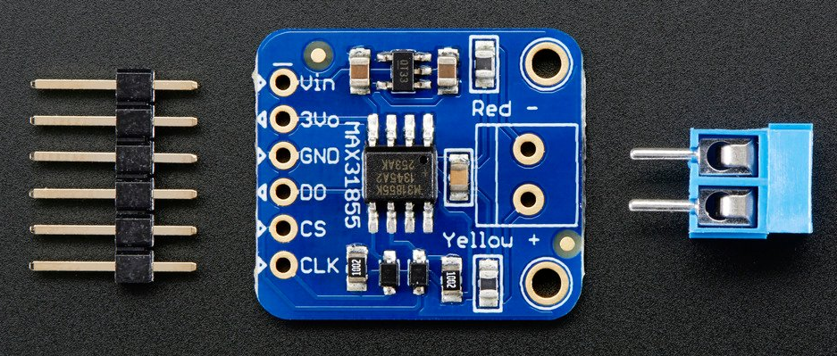
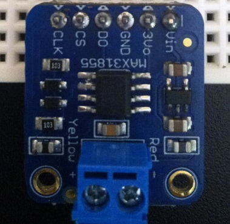
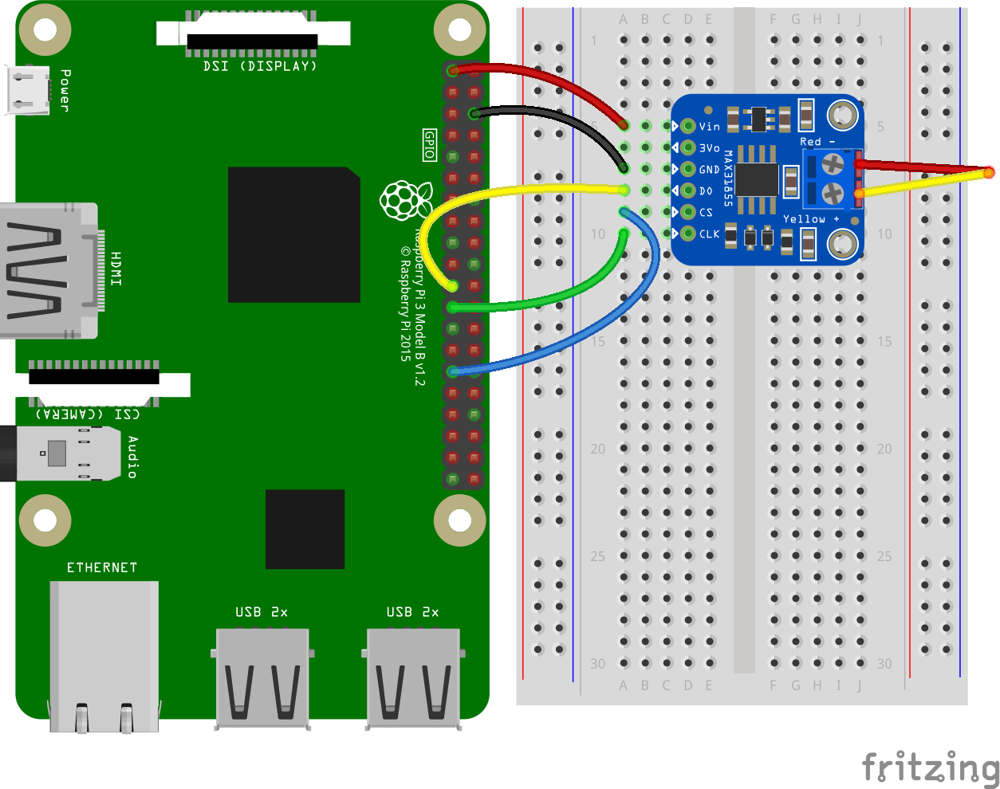
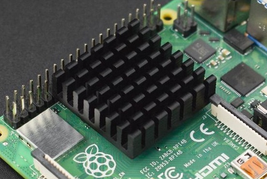

# pitmaster

## Hardware parts

| Item                                                                                                                 | Purpose                        |
| -------------------------------------------------------------------------------------------------------------------- | ------------------------------ |
| [rpi 3 model B+](https://core-electronics.com.au/raspberry-pi-3-model-b-plus.html)                                   | mini computer                  |
| [MAX31855](https://core-electronics.com.au/thermocouple-amplifier-max31855-breakout-board-max6675-upgrade-v2-0.html) | Read thermocouple              |
| [K-type thermocouple](https://core-electronics.com.au/thermocouple-type-k-glass-braid-insulated.html)                | read temperatures              |
| [heatsink](https://core-electronics.com.au/al-heat-sink-with-adhesive-tape-28x28x9mm.html)                           | reduce board temperature       |
| [Female to male jumper cables](https://core-electronics.com.au/jumper-wires-7-8-f-m-high-quality-30-pack.html)       | connect pi GPIO to breadboard  |
| [breadboard](https://core-electronics.com.au/solderless-breadboard-830-tie-point-zy-102.html)                        | create circuits                |
| [LEDs](https://core-electronics.com.au/5mm-leds-100-pcs-pack-20x-red-green-blue-yellow-white.html)                   | visually indicate current temp |
| [solder](https://core-electronics.com.au/solder-leaded-15-gram-tube.html)                                            | create circuits                |
| [soldering iron](https://core-electronics.com.au/hakko-red-soldering-iron-20w.html)                                  | melt solder                    |
| [jumper wire kit](https://core-electronics.com.au/jumper-wire-kit.html)                                              | connect circuits on breadboard |
| [resistors](https://core-electronics.com.au/resistor-kit-1-4w-500-total.html)                                        | create circuits                |

## Guide

The MAX31855 ships like this

Solder the pieces together to look like this (long legs downwards to fit into breadboard). Ignore the circuits above

Put the MAX31855 anywhere into the breadboard, note that the actual location doesn't matter (within electrical circuit reason). If you want specifics, just follow this image.

For beginners, note that the MAX31855 is inserted on the left half (ABCDE) and positioned not in column A as thats where the jumper cables connect.

Connect the GPIO to breadboard circuit like so

| GPIO         | MAX31855 breadboard |
| ------------ | ------------------- |
| 3.3V (#1)    | Vin                 |
| GND (#6)     | GND                 |
| MISO (#21)   | DO                  |
| GPIO 5 (#29) | CS                  |
| SCLK (#23)   | CLK                 |

Optionally, add your heatsink

Enable SPI on the pi (raspi-config //TODO: ansible task) and reboot

## Sources

- [adafruit unsupported guide for the pi GPIO headers](https://learn.adafruit.com/max31855-thermocouple-python-library/hardware)
- [adafruit ]
- [rpi 3 model B GPIO diagram](https://www.etechnophiles.com/raspberry-pi-3-b-pinout-with-gpio-functions-schematic-and-specs-in-detail/)
- [rpi 3 model B GPIO diagram](https://www.etechnophiles.com/wp-content/uploads/2020/12/HD-pinout-of-R-Pi-3-Model-B-GPIO-scaled.jpg)
- [rpi 3 model B GPIO diagram](https://pi4j.com/1.4/pins/rpi-3b.html)
- [rpi 3 model B GPIO diagram](https://pi4j.com/1.2/pins/model-3b-rev1.html)
- [rpi 3 model B GPIO diagram](https://community.element14.com/products/raspberry-pi/m/files/17428)
